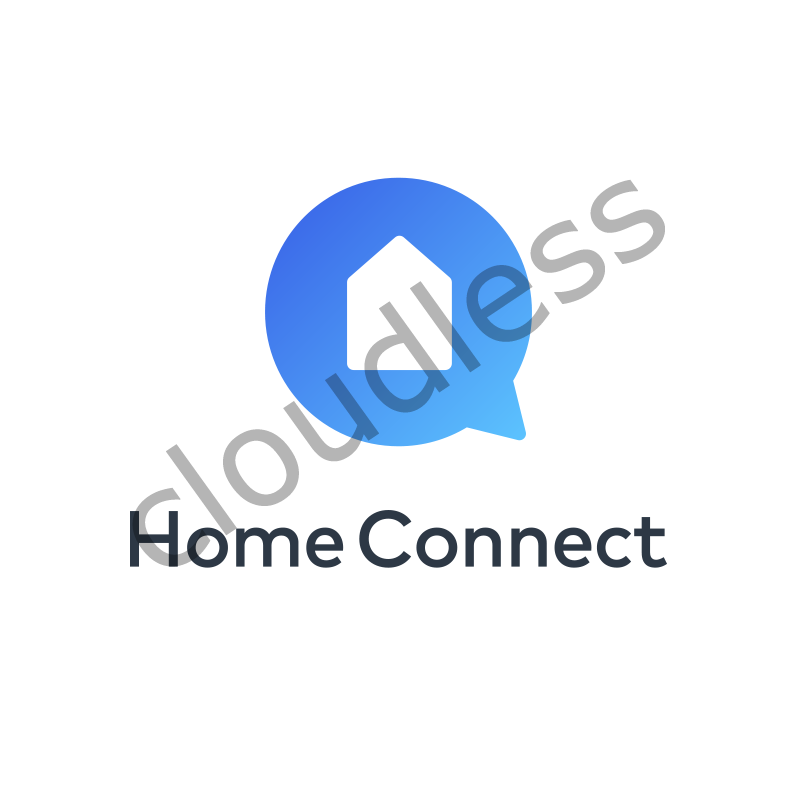
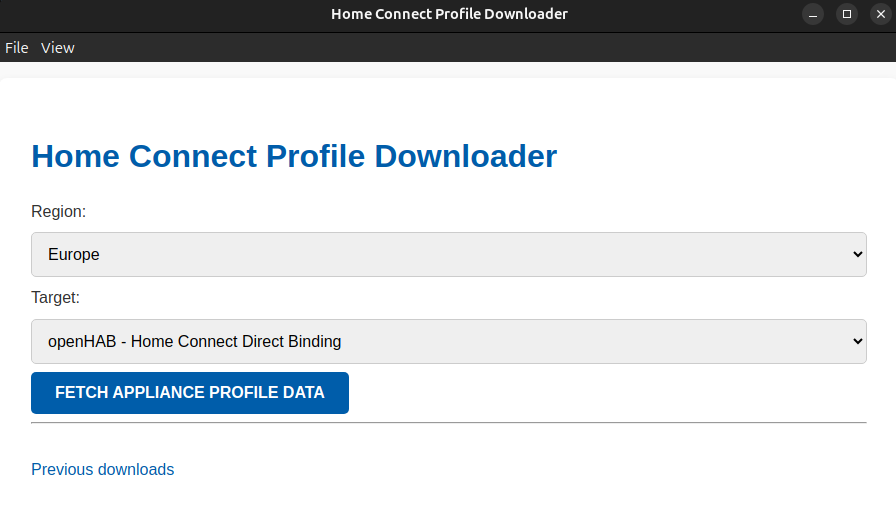

# ioBroker.cloudless-homeconnect

Adapter for Homeconnect devices without cloud communication

## Homeconnect Adapter without cloud

The adapter does not require an API for Homeconnect (https://api-docs.home-connect.com/), which requires the devices to be connected to the Internet. In this adapter, communication and control of the devices takes place locally after a configuration has been created once. The devices can therefore be completely separated from the Internet after they have been registered in the Homeconnect app. In order to load the correct configuration, an internet connection must be established.

The basic idea for this adapter comes from https://github.com/osresearch/hcpy. The Python code there was ported to JavaScript here and adapted for ioBroker.

## Prerequisites before installation

At least Node.js **version 20** must be installed.

In contrast to using the official API, <ins>no</ins> ClientID is required for the adapter, only the username and password that were used in the Homeconnect app. Devices must be registered once via the Homeconnect app.

Port 443 must be enabled on the device in the local network.

It may happen that the device cannot be addressed after loading the configuration. Then there is no DNS entry for the device's domain in the local network. In addition to setting this up in the network, you can simply enter the local IP of the device in the `info.config` data point at `host`.

## First steps

Normally, profiles of the registered devices are retrieved from Homeconnect servers after [adapter configuration](#configuration) when the adapter starts. This login process has been changed on some servers so that automatic downloading of the profiles no longer works and manual downloading is necessary. The external tool **[Homeconnect Profile Downloader](https://github.com/bruestel/homeconnect-profile-downloader/tags)** is recommended.

So if automatic retrieval is not possible, a **warning** will appear in the ioBroker log, **_if none appears and the adapter starts normally, no further action is necessary and the next steps can be ignored!_**

```
warn: Login not successful. Please put the zip from homeconnect-profile-downloader as described in docs manually into path <<Path to the storage location of downloaded device profiles>> and restart adapter. See https://github.com/bruestel/homeconnect-profile-downloader also.
```

If the warning is issued, the **Homeconnect Profile Downloader** must be installed locally. To do this, follow the link, download the latest version for your operating system and [install](https://github.com/bruestel/homeconnect-profile-downloader?tab=readme-ov-file#run-it):


Then start the installed application and select the region on the homepage:


By clicking on 'FETCH APPLIANCE PROFILE DATA' you will be redirected to the Homeconnect login page, where you must log in using the access data from the Homeconnect app:


If this was successful, an overview of zip files will appear for each device registered via the Homeconnect app. The zip files must now be downloaded and moved **as is** to the folder shown in the warning in the ioBroker log.

The adapter must then be restarted. The configuration for the adapter is now created from these files.

## Configuration

The Homeconnect app user name and password must be entered in the adapter config.

The parsed configuration is saved in the `info.config` data point. This should not be changed. If devices are added or removed from the network, they must be registered via the Homeconnect app and the content of the above data point must be deleted. The adapter then restarts, connects to the configured account and reads the configuration again. Communication with the devices then takes place purely locally again.

If connection errors occur over time, a new connection to the device is attempted. This happens 15 times by default, but can be set for the instance. If the attempt is never to be aborted, i.e. the connection is to be tried again and again, a `0` must be set.

## Datapoints

The most important data points are described here. The UID that the respective device knows and uses is stored in the name. If a value is changed that is implausible for the device at that moment, a log entry is written in debug mode. This can happen if, for example, `AbortProgram` is changed even though no program is currently active. The structure is constructed, for example, as follows:

```
<cloudless-homeconnect.0>
|
└── info
│       └── config
│
└── <Geräte-ID>
│       └── Command
│       |       └── AbortProgram
│       |       └── PauseProgram
│       |       └── ...
│       └── Event
│       |       └── ProgramFinished
│       |       └── CavityTemperatureTooHigh
│       |       └── ...
│       └── Option
│       |       └── ElapsedProgramTime
│       |       └── ProgramProgress
│       |       └── ...
│       └── Program
│       |       └── KeepWarm
|       |       |       └── Start
|       |       |       └── Duration
|       |       |       └── ...
│       |       └── Hot_Air
|       |       |       └── Start
|       |       |       └── Duration
|       |       |       └── ...
│       |       └── ...
│       └── Setting
│       |       └── ChildLock
│       |       └── PowerState
│       |       └── ...
│       └── Status
│       |       └── BackendConnected
│       |       └── CurrentTemperature
│       |       └── ...
|       └── ActiveProgram
|       └── SelectedProgram
|       └── sendOptionsSeperately
```

### info.connection

This data point becomes false if the connection to **at least** one device cannot be established, i.e. in the event of a socket error. This also turns the adapter "yellow" in the instance overview. A new connection to the device is automatically attempted 15 times with a maximum waiting time of 5 minutes. The adapter would then have to be restarted manually to establish a connection again. However, the number of new connections can be changed in the instance settings (see [Configuration](#configuration)). Why the device cannot be connected and which device it is can be found in warning entries in the log. Here you then have to look “manually” at how to fix the problem. The data point is only set for devices that are being monitored by the adapter (see [observe](#observe)).

### info.config

Here the configuration is saved as JSON. If this needs to be read in again, for example because new devices have been added, the content must be deleted and the adapter must be restarted if necessary.

### `ActiveProgram` and `SelectedProgram`

The data points contain the UID of the program that is currently running as a value. `ActiveProgram` is `readonly`.

### observe

With the data point `observe`, devices can be excluded from monitoring the adapter when changed to `false`. For example, in the event of an error, it can be set that only one device is taken into account by the adapter and no other device "intermediates".

### sendOptionsSeperately

Normally, to start a program, the necessary options are sent to the device as a whole. However, on some devices it is expected that these options are not transmitted as a block but individually.

> [!NOTE]
>
> If starting a program doesn't work as desired or if the debug log says something like `resource":"/ro/activeProgram","version":1,"action":"RESPONSE","code":400}`, this data point can be changed to `true` before trying to start a program again.

### Command

Under `Command`, data points from the `button` role are collected, which the device makes available for remote control. A reaction from the other side can only be expected if the command is plausible: `AbortProgram` is only executed if a program is also active.

### Event

If a certain event such as "a program is finished" occurs, the corresponding data point in the "Event" folder is triggered.

### Option

The only readable data points that affect the programs can be found under Options. The writable options can be found under the `Program` folder. Since only one program can be active at a time, the readable options always refer to the currently running program.

### Program

The respective program can be started via the data point 'Start'. In addition, the options that the program supports are read and transmitted. Therefore, it is important to set the options **before** clicking `Start`. If the program is running, it will be displayed in `ActiveProgram`.

If a program is started even though a program is already active, the active program is first terminated by the adapter.

### Setting

General settings for the device can be made here. For example, the light of an oven can be switched on or off using the setting `Light_Cavity_001_Power`. The data point `InteriorIlluminationActive` under `Status` is only readable and only shows the status of the lighting.

### Status

`Status` contains an overview of the status of the device. These are only readable.
